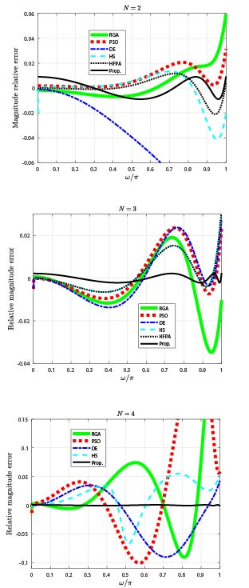
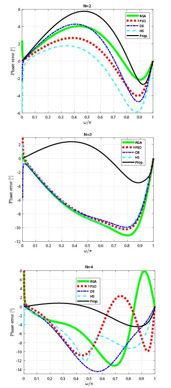

Parts of the code for the paper "Design of IIR full-band integrators with equiripple relative magnitude error"

We have designed integrators up to the fourth order. All poles and zeros of the transfer function are real and simple, situated on the negative part of the real axis.
These integrators, regardless of their order, exhibit an approximately linear phase with a slope of -0.5. In essence, they offer short warm-up periods, and the selection among them depends on the maximum acceptable magnitude and phase errors. 

The approach employed in this paper is based on identifying the initial zeros within the amplitude error and utilizes the Taylor series approximation to achieve an equiripple solution.
The resulting filters demonstrate remarkable performance, surpassing other reported designs in terms of both amplitude and phase error. Additionally, as the order of the proposed integrators increases, both amplitude and phase errors decrease.
It's worth highlighting that the proposed third-order integrator outperforms the fourth-order integrators used for comparison.

On average, all proposed filters exhibit a group delay of 0.5 samples, making them favorable for real-time system applications. Among these designs, the proposed fourth-order integrator demonstrates significantly lower magnitude and phase errors compared to known solutions.
For an integrator of the order N there are 2^(2N) solutions with identical equiripple magnitude errors. The selected proposed integrator is the one with the smallest phase error.

Below are the comparisons of our filters with the current literature:

